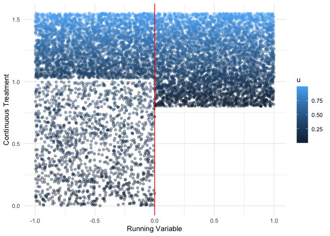
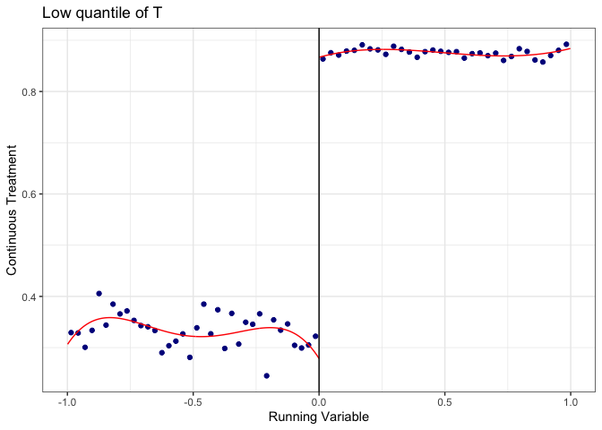
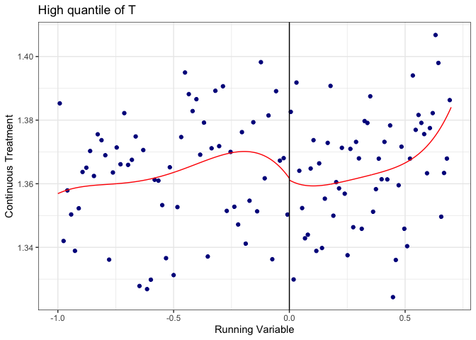

<!-- README.md is generated from README.Rmd. Please edit that file -->

# ContinuousRD

<!-- badges: start -->
<!-- badges: end -->

ContinuousRD is a package that implements regression discontinuity
designs when the treatment variable is continuous following [Dong, Lee,
and Gou
(2022)](http://www.yingyingdong.com/Research/RD_ContinuousTreatment.pdf)

## Installation

You can install the development version of ContinuousRD from
[GitHub](https://github.com/) with:

``` r
# install.packages("devtools")
devtools::install_github("kylebutts/ContinuousRD")
```

## Setting

I will provide a quick (and simplified) overview of the methods from
[Dong, Lee, and Gou
(2022)](http://www.yingyingdong.com/Research/RD_ContinuousTreatment.pdf).
For the full details, please see the original text. I’m purposefully
leaving out details since hopefully you are here *after* reading the
paper :-)

Let $Y$ denote the outcome variable and $T$ a continuous variable of
interest. There exists a running variable $R$ and a cutoff $c$ (which
we’ll normalize to zero) that affects the treatment $T$. The paper
assumes that different quantiles of $T$ are differentially affected by
the discontinuity.

For example, in the paper they discuss a minimum capital requirement for
banks in cities with population over 3,000 in 1900. The running variable
would be population and the treatment variable is banking capital.
Clearly, only banks with counterfactual banking capital below the
threshold are affected by the population cutoff. Therefore the jump in
$T$ will be zero for most banks, but positive for banks at the lower end
of the counterfactual distribution of $T$.

For this reason, the estimator proposed in the paper wants to estimate
the LATE at different quantiles of the distribution of $T$, which they
denote as the Quantile-LATE or QLATE for short. The method proceeds as
follows.

For a given quantile of $T$, denoted $u \in (0,1)$, estimate the
“first-stage” RD of $T$. Define $q^+(u)$ be the $u^{th}$ percentile of
$T$ under treatment at $R = 0$ and $q^-(u)$ be the $u^{th}$ percentile
of $T$ under no treatment at $R = 0$. The RD estimate of $T$ would
therefore estimate This will estimate
$\mathbb{E}[ q^+(u) - q^-(u) \vert U = u, R = 0]$. Intuitively, this
gives the jump in the continuous treatment for units at the $u^{th}$
percentile of the distribution.

Then, the reduced form involves running an RD of $Y$ using observations
to the right of the cutoff with values of $T$ near $T_1(u)$ and to the
left of the cutoff with values of $T$ near $T_0(u)$. The left and right
limits in the RD would respectively identify

$$
m^-(u) = \mathbb{E}[ Y | T = q^-(u), R = 0] \text{ and } m^+(u) = \mathbb{E}[ Y | T = q^+(u), R = 0] 
$$

The difference between these two terms would estimate the jump in $Y$
for units near the $u^{th}$ percentile of $T$. The QLATE estimate will
then be the ratio of these two quantities. Intuitively it’s the jump in
$Y$ rescaled by the jump in $T$. Note that only quantiles that have a
significant jump $q^+(u) - q^-(u) \neq 0$ are used to form estimates
(since otherwise the denominator is 0).


A visual example using a made-up DGP similar to the paper’s main example
is shown here for a given quantile $u = 0.1$. The left-figure shows the
estimated jump in $T$. The right-figure shows the estimated jump in $Y$
at value of $q^-(u)$ and $q^+(u)$. The ratio of these two estimates
would be the estimated treatment effect and can be interpreted as the
jump in $Y$ per unit increase in $T$.

## Example

I will use a set of simulated data as an illustration of the method

``` r
library(ContinuousRD)
#> Loading required package: data.table
# Load data
data(sim_data)

head(sim_data)
#> Key: <id>
#>       id         u           R     Z         T         Y
#>    <int>     <num>       <num> <num>     <num>     <num>
#> 1:     1 0.2002145 -0.71892650     0 0.6673815 0.6652777
#> 2:     2 0.6852186  0.19781138     1 1.3139139 1.3141626
#> 3:     3 0.9168758  0.03111523     1 1.4876568 1.4881608
#> 4:     4 0.2843995  0.64044390     1 1.0132996 1.0165819
#> 5:     5 0.1046501 -0.75736198     0 0.3488338 0.3474286
#> 6:     6 0.7010575  0.06593254     1 1.3257931 1.3291840
```

The data consists of 10000 observations each of which is a unique unit.
The variable `Y` is the outcome variable, `T` is the continuous
treatment of interest, `R` is the running variable with a cutoff of $0$.
Positive values of the running variable are affected by the border, in
this case a binding lower bound on `T`. The variable `u` is the
(typically unobserved) percentile of each unit for the variable `T`.

The below data shows the observed continuous treatment along the running
variable. The color of the dot represents the quantile of `T` at that
value of `R`. You can see a clear jump at the border where `T` is
affected by the binding constraint.

``` r
library(ggplot2)
ggplot(sim_data) +
    geom_point(
        aes(x = R, y = T, color = u),
        alpha = 0.4
    ) + 
    geom_vline(xintercept = 0, color = "red") +
    labs(
        x = "Running Variable",
        y = "Continuous Treatment"
    ) +
    theme_minimal()
```



However, this is only binding for units at the lower end of the
distribution. To see this more clearly, let’s look at multiple RDs at
different quantiles of `T`.

``` r
library(rdrobust)

low_q = sim_data[sim_data$u > 0 & sim_data$u < 0.2,]
high_q = sim_data[sim_data$u > 0.5 & sim_data$R < 0.7,]

rdrobust::rdplot(
    y = low_q$T, x = low_q$R, 
    title = "Low quantile of T", y.label = "Continuous Treatment", x.label = "Running Variable"
)
```



``` r
rdrobust::rdplot(
    y = high_q$T, x = high_q$R, 
    title = "High quantile of T", y.label = "Continuous Treatment", x.label = "Running Variable"
)
```



The data is simulated to have units with quantile below $0.3$ be
affected by the cutoff (the magnitude of the change in `T` depends on
quantile `u`) and those units experience a treatment effect of size $1$.
Let’s see if we get that using the `QLATE_bc_se` function:

``` r
res <- ContinuousRD::QLATE_bc_se(sim_data, qlist = seq(0.1, 0.9, by = 0.1), yname = "Y", tname = "T", rname = "R", c = 0)
#> `qlist`: 0.1, 0.2, 0.3, 0.4, 0.5, 0.6, 0.7, 0.8, and 0.9
#> `tau_u`: 1, 1.001, NA, NA, NA, NA, NA, NA, and NA
#> `SEtau`: 0.005, 0.018, NA, NA, NA, NA, NA, NA, and NA
#> `tau_u_bc`: 0.992, 0.985, NA, NA, NA, NA, NA, NA, and NA
#> `SEtau_bc`: 2.384, 7.942, NA, NA, NA, NA, NA, NA, and NA
#> `pi`: 1.001
#> `SEpi`: 0.004
#> `pi_bc`: 0.991
#> `SEpi_bc`: 0.359
```

In the printed results a value of `NA` appears when no significant jump
in the treatment variable is found at the cutoff. In this case, since
the jump around the 30th percentile is near zero, it doesn’t show up in
the estimate. However, we see there the effect is around $1$ as expected
for the 10th and 20th percentile. The overall average effect `pi` is
also approximately $1$ as well.
